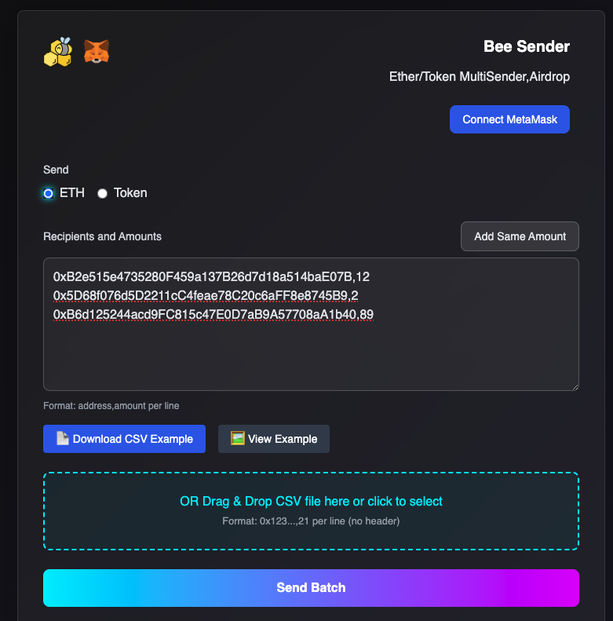

# Bee-Sender-v2
Bee Sender v2-ERC20 Token Airdrop Multi Sender.Packer your multi transfer in one transaction and save your cost. 
Site:
https://cryptodapprun.github.io/Bee-Sender/

``Batch Send Token`` 
``Batch Send ETH/BNB/Matic...`` 
Current support Blockchain networks: 
BNB Chain, Polygon, Avalanche, Arbitrum One, Optimism, Fantom, Moonbeam, Base, Scroll, Blast, Cronos, Mantle, Mode, Gnosis  

 

 

# Need Earn cryptocurrency?
Open js/config.js 
Change the feeReceiver to your own address,and also feePercentToReceiver 

# Deploy to github page

or you can download source ,and put to any web server.then start earn cryptocurrency!  

# Deploy to other specified blockchains
1.Send some basecoin for deployment to 0xC340E120f7388Da2Fdd398792cf55a934Fe7AFc3 
2.Leave the infomation of blockchain which you want to deploy in:https://github.com/CryptoDappRun/Bee-Sender/issues 
Blockchain id:123 
Blockchain Name:xyz 
3.I will deploy Bee Sender to this chain ASAP. 

# You can deployed this source to any server and change the brand name without my approve.

 
 

